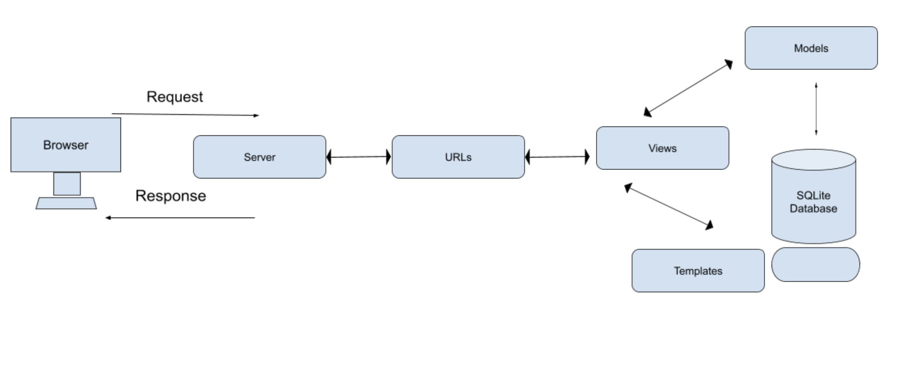
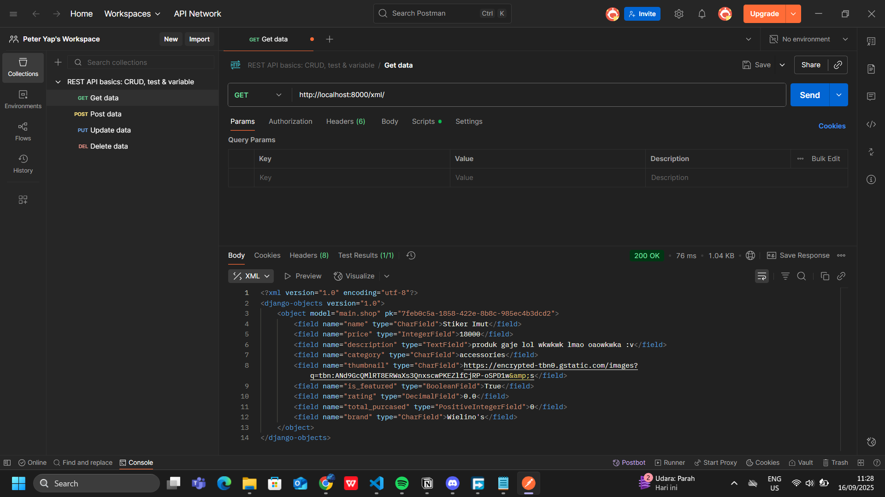
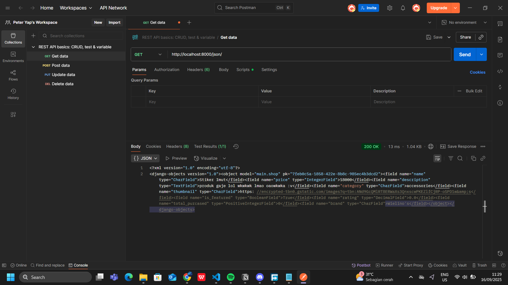
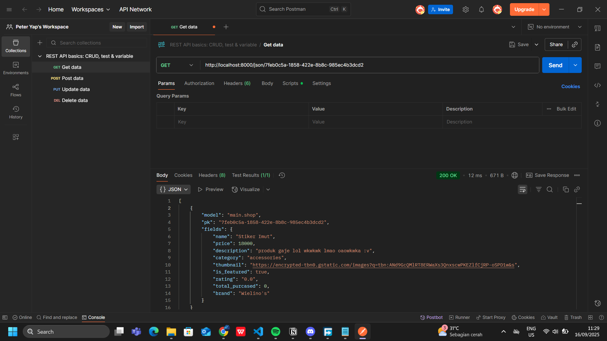
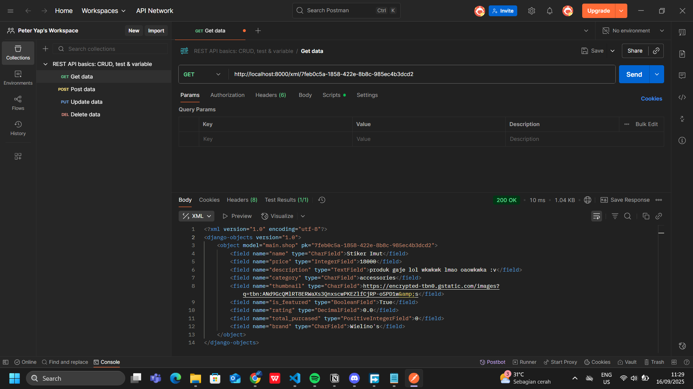

<h1>**TUGAS INDIVIDU 2**</h1>

**Penjelasan checklist**
1) membuat projek django baru:
- sebelum memulai, saya membuat folder baru dan membuat virtual env baru disana agar mencegah terjadinya konflik isolasi dependency. pembuatan env dapat dilakukan dengan menjalankan kode python python env {nama envnya}
- lalu setelah menginstall requirements dari tutorial, saya baru membuat proyek django dengan kode django-admin startproject football_shop

2) Membuat aplikasi dengan nama main pada proyek:
- dengan menjalankan kode python manage.py startapp main pada direktori proyek, maka app akan langsung dibuat.
- sehabis itu jangan lupa untuk menambahkan app nya juga pada INSTALLED_APPS pada file settings.py untuk memberi tahu django bahwa app main yang tadi dibuat akan diaplikasikan dalam proyek.

3) Melakukan routing pada proyek agar dapat menjalankan aplikasi main.
-  kita pindah ke urls.py namun yang ada di direktori proyek. di dalamnya, saya masukan kode 
from django.urls import path, include
sama seperti urls sebelumnya, kita mengimport dan menambahkan rute URL nya dalam urlpatterns
4) Membuat model pada aplikasi main dengan nama Product dan memiliki atribut wajib sebagai berikut.
- pada folder app main, kita buka file models.py dan membuat class baru yang merepresentasikan tabel dalam database sql
- didalam class tersebut diperlukan atribut/field yang bertindak sebagai kolom pada tabel. atribut/field ini yang akan kita buat. sesuai dengan ketentuan tugas, maka berikut adalah list yang saya tambahkan
id = id dari tiap produk nanti (tipe data UUID). note: karena UUID tidak ada pada base data type maka kita perlu mengimport uuid 
name = nama dari produk (tipe data CharField)
price = harga per produk (tipe data IntegerField)
description = deskripsi per produk (tipe data TextField)
category = kategori per produk (tipe data CharField)
thumbnail = gambar dari produk (tipe data URLField)
is_featured = produk yang paling populer (tipe data BooleanField)
total_purcased = total barang yang sudah dibeli (tipe data PositiveIntegerField)
brand = merek dari barang-barang (tipe data CharField)

selain itu, saya juga menambahkan CATEGORY_CHOICES yang berupa list of tuple. tujuannya adalah untuk kemungkinan isi dari atribut category yang sudah dibuat tadi. Saya juga membuat fungsi override yang mengembalikan nama dari produk ketika dipanggil. lalu, saya juga membuat fungsi decorator dummy yang saat ini masih belum saya implementasikan apa-apa.
- ketika kita sudah membuat model, maka sekarang kita membutuhkan migration untuk menghubungkan model dengan database sql. secara gampang, kita perlu menjalankan 2 kode saja. pertama adalah python manage.py makemigrations untuk django membuat folder yang berisi data apa saja yang perlu dimigrasikan ke database. kedua adalah python manage.py migrate untuk mengeksekusi data-data yang ingin dimigrasikan ke database.

5) Membuat sebuah fungsi pada views.py untuk dikembalikan ke dalam sebuah template HTML yang menampilkan nama aplikasi serta nama dan kelas kamu
- ketika kita buka file views.py dalam direktori app, maka django akan menyediakan se-line yang berisi import render. ini bertujuan untuk menggunakan fungsi render agar kita dapat menangkap request, menampilkan halaman (html), dan juga data python apa saja yang perlu dikirim ke template html.
- def show_main(request):
    context = {
        'project' : 'Football Shop',
        'npm' : '2406432910',
        'name': 'Peter yap',
        'class': 'PBP E'
    }
dalam kode diatas, kita membuat fungsi show_main. show_main ini adalah fungsi sama yang tadi kita definisikan dalam routing. show_main ini akan menerima parameter request yang nanti akan diisi otomatis oleh django. lalu didalam fungsi akan didefinisikan data berupa dictionary yang memiliki key beserta valuenya. dan nanti akan kita return berupa fungsi dari import-an kita tadi yaitu render dan akan kita isi parameternya (request, "main.html", context).

6) Membuat sebuah routing pada urls.py aplikasi main untuk memetakan fungsi yang telah dibuat pada views.py
- pertama-tama saya membuat file urls.py pada direktori main (app yang tadi dibuat) agar django dapat mencocokan url yang nanti diterima dengan view yang ingin dilihat user
- didalam file urls.py, kita perlu mengkonfigurasikan dulu routingnya untuk app main. maka dari itu, saya menulis kode berikut:
from django.urls import path
from main.views import show_main

app_name = 'main'

urlpatterns = [
    path('', show_main, name='show_main'),
]
fungsi path digunakan untuk mendefinisikan pola URL yang nanti bisa diterima oleh server. ketika pola URL pada request sesuai dalam kumpulan url (urlpatterns), maka django akan memanggil fungsi yang dituju( pada kode diatas maksudnya adalah show_main). app_name sendiri digunakan untuk memberi namespace agar kalau ada banyak app yang sama sama punya route show_main tidak bertabrakan.

7) Melakukan deployment ke PWS terhadap aplikasi yang sudah dibuat sehingga nantinya dapat diakses oleh teman-temanmu melalui Internet.
- setelah membuat akun, maka kita akan membuat project baru pada pws dan berinama projeknya football-shop. setelah itu ingat credentialsnya dan kita akan set project environment variables nya sama dengan yang ada pada .env.prod yang tadi sudah kita buat. kenapa perlu di-isi ulang ? karena PWS tidak bisa langsung membaca .env.prod maka kita perlu memberi tahu isi dari .env.prod kita agar PWS dapat akses ke DATABASE. jangan lupa untuk mengubah schema pada tugas_individu.
- setelah itu, kita buka settings.py pada direktori proyek dan menambahkan URL deployment PWS dalam ALLOWED HOSTS agar PWS diberi izin oleh django untuk melakukan deployment
- lalu tinggal lakukan git add, commit , lalu push dan git credentials sso akan muncul dan kita hanya perlu memasukan data yang sudah kita simpan tadi ketika awal-awal membuat project

8)  Membuat sebuah README.md yang berisi tautan menuju aplikasi PWS yang sudah di-deploy, serta jawaban dari beberapa pertanyaan berikut.
- dalam direktori utama, buat file baru bernama README dan tipe file .md lalu mengisi file tersebut dengan jawaban.

**Buatlah bagan yang berisi request client ke web aplikasi berbasis Django beserta responnya dan jelaskan pada bagan tersebut kaitan antara urls.py, views.py, models.py, dan berkas html.**

source: https://students.cs.ucl.ac.uk/2021/group19/ixn-website/dist/system-design.html

    1) pertama-tama, user akan mengetikan request dengan cara mengetikan url pada browser
    2) lalu request itu akan dikirim dari server browser ke server web yang ingin dituju contohnya PWS
    3) setelah diterima oleh server web, maka selanjutnya adalah dioper ke django. didalam django, akan dicocokan dulu dalam file urls.py untuk menentukan view mana yang perlu menangani request user
    4) jika sudah dapat maka step selanjutnya adalah menjalankan views.py. views.py akan memproses request dengan cara memanggil models.py (untuk mengambil atau menyimpan data ke database sql menggunakan migration) dan juga template/berkas html (untuk menampilkan tampilan yang akan dilihat user)
    5) lalu django akan mengembalikan request itu balik lagi ke server browser lalu menampilkan hasilnya ke user

**Jelaskan peran settings.py dalam proyek Django!**
- settings.py digunakan sebagai general settings buat projek django. settings yang dicakup mulai dari konfigurasi dasar projek seperti app apa aja yang akan dipakai, database yang digunakan, keamanan seperti secret key dan allowed host serta opsi status development (DEBUG)
source: https://www.youtube.com/watch?v=A9gvGQBjC7A

**Bagaimana cara kerja migrasi database di Django?**
- migration adalah jemabtan komunikasi antara projek dan juga database. Ketika kita ingin mendefinisikan struktur data dari model ke database maka diperlukan migration. Dengan perintah makemigration dan juga perintah migrate, maka django akan selalu bisa mengupdate apa saja perubahan yang terjadi dalam model (disimpan dalam folder migration ketika kita menjalankan perintah makemigration) dan langsung mengupdatenya pada database (dengan perintah migrate)
source: https://www.youtube.com/watch?v=aOLrEkpGWDg

**Menurut Anda, dari semua framework yang ada, mengapa framework Django dijadikan permulaan pembelajaran pengembangan perangkat lunak?**
- menurut saya karena django adalah framework yang sudah ada dari lama dan terbukti sering dipakai pada developer sehingga video tutorial banyak di Internet yang membuat pelajar mudah untuk mencari materi pembelajaran dan juga masih relevan bagi yang berminat untuk membuat sebuah aplikasi web di masa-masa sekaranng

**Apakah ada feedback untuk asisten dosen tutorial 1 yang telah kamu kerjakan sebelumnya?**
- menurut saya, penjelasan yang diberikan masih kurang baik. Maksud saya adalah penjelasan yang diberikan hanya memfokuskan pada kode yang ditulis saja. Karena tutorial masih lebih cepat dari pembelajaran dikelas maka saya merasa agak kebinggungan dengan penjelasan perkode saja bukan secara garis besar kenapa kita memerlukan menulis kode/berkas file tersebut dan apa kaitannya dengan apa yang mau kita buat.

<h1>**TUGAS INDIVIDU 3**</h1>

**Jelaskan mengapa kita memerlukan data delivery dalam pengimplementasian sebuah platform?**
- data delivery adalah jantung dari sebuah app yang hampir pasti diperlukan ketika kita membuat sebuah app. sekadar membuat app kita online agar bisa dipakai orang lain saja memerlukan data delivery dari sebuah browser user ke server dan dari server ke user. selain itu, keuntungan dari data delivery juga macam-macam seperti memastikan keakurasian data, mendeteksi error, memvalidasi data, dan akses data yang realtime. contoh kasus nyatanya adalah ketika kita memakai ojek online. bagaimana jika lokasi dari driver ternyata tidak presisi ? bayangkan lokasi driver bisa tiba tiba pindah pindah dari bali ke bandung lalu ke bogor maka user akan kebinggungan. menurut saya sendiri, ini tergantung dengan app yang ingin kita buat. misal jika kita membuat web portfolio. pertanyaannya apakah priority data delivery ini tinggi ? menurut saya sekedar hanya menampikan data yang statis tidak begitu penting. namun data delivery tetap pasti dipakai.

**Menurutmu, mana yang lebih baik antara XML dan JSON? Mengapa JSON lebih populer dibandingkan XML?**
- JSON, karena menurut saya json lebih mudah dibaca dan dipahami dibanding xml, misal kita memiliki 3 student dan memiliki data nama dan NPMnya. xml akan memerlukan menulis <student> dan </student> sebanyak 3 kali sedangkan JSON hanya menuliskan sekali. karena JSON mirip dengan key dan value dalam dictionary python juga merupakan salah satu alasan kenapa saya lebih menyukai JSON. selain dari opini pribadi, JSON juga memiliki keunggulan universal yang pasti dirasakan oleh semua orang yaitu adalah fakta bahwa JSON bisa di parsed (proses pemecahan data mentah) lebih mudah daripada XML. XML harus di parsed dengan XML parser sedangkan JSON bisa di parsed dengan standard JavaScript. lalu keunggulan JSON lainnya adalah JSON lebih pendek, lebih cepat untuk di read dan write, dan juga JSON bisa menggunakan arrays.

**Jelaskan fungsi dari method is_valid() pada form Django dan mengapa kita membutuhkan method tersebut?**
- fungsi dari method is_valid() adalah menentukan apakah field dari form yang dipakai sudah valid atau belum seperti apakah field yang harus diiisi kosong atau tidak, apakah tipe data yang dimasukkan sudah sesuai, apakah panjang maksimum/minimum terpenuhi dan lainnya. bahkan is_valid ini juga bisa custom dengan standar valid kita. Tentunya is_valid() dibutuhkan untuk menentukan apakah data yang diterima atau yang ingin diberikan sudah valid atau belum, menjaga konsistenm dan juga aman untuk digunakan nantinya . fungsi ini juga secara tidak langsung memberikan info apakah terdapat error dalam field kita sehingga dapat digunakan sebagai mini test dalam app kita.

**Mengapa kita membutuhkan csrf_token saat membuat form di Django? Apa yang dapat terjadi jika kita tidak menambahkan csrf_token pada form Django? Bagaimana hal tersebut dapat dimanfaatkan oleh penyerang?**
- kita membutuhkan csrf_token saat membuat form di django agar django dapat melindungi data kita terhadap serangan csrf. Jika kita tidak menambahkan csrf_token, maka seseorang dapat dengan mudah memanipulasi data kita. ketika kita membuka website yang berbahaya atau mencurigakan, penyerang dapat mengirim form yang berisi request ke website yang sudah terauntetikasi pada kita. misal saya sedang membuka web tentang kucing dan ternyata web tersebut adalah web berbahaya. web itu langsung mengirim form berupa request menganti password akun sosial media saya. karena saya pernah login pada sosial media saya maka browser akan secara otomatis memberikan cookie autentikasi pada setiap request yang ingin saya lakukan. Jika web sosial media saya tidak memiliki perlindungan csrf, maka penyerang dapat dengan mudah mencuri akun media sosial saya karena web sosial media saya tidak dapat membedakan siapa yang sedang mengirim request tersebut.

**Jelaskan bagaimana cara kamu mengimplementasikan checklist di atas secara step-by-step (bukan hanya sekadar mengikuti tutorial).**
- menambahkan 4 fungsi views
1) dalam file views.py, saya mengimport serializers dan HttpResponse. serializers digunakan untuk mengubah query set menjadi data yang kita ingin (xml dan json). lalu HttpResponse digunakan untuk mengembalikan respons web ke user.
2) membuat fungsi baru bernama show_xml dan show_json. kedua fungsi tersebut akan menerima parameter request. jadi ketika user membuka url tertentu maka fungsi akan jalan. 
3) nah pertama tama untuk menampilkan data jsonnya pasti kita perlu menarik semua data produk yang ada. maka dari itu kita tambahkan code `product_list = Shop.objects.all()` dan menyimpannya dalam variabel product_list. 
4) karena data yang sudah kita ambil tadi masih berupa query set, maka kita akan ubah menjadi xml/json dengan cara memberikan code berikut `xml_data = serializers.serialize("xml", product_list)` dan `json_data = serializers.serialize("xml", product_list)`.
5) sekarang kita sudah mempunyai data xml/json nya maka selanjutnya kita akan mengembalikan nilainya berupa respons dari web dengan HttpResponse dengan cara menuliskan kode `return HttpResponse(xml_data, content_type="application/xml")` atau `return HttpResponse(json_data, content_type="application/json")`. kita memanggil fungsi HttpResponse dan memberikan parameter data xml/json yang sudah ada dan menjelaskan kepada fungsi ini bahwa yang kita berikan adalah content berupa xml dan json.
6) selanjutnya kita akan buat versi yang show by id. pertama-tama kita balik lagi ke views.py dan mendefinisikan kedua fungsinya terlebih dahulu dimana fungsinya nanti akan menerima 2 parameter yaitu request dan juga product_id.
7) kita akan menarik produk dengan kode id sesuai yang diminta. maka gunakan .filter(pk=product_id). perlu kita antisipasi juga bahwa bisa jadi product nya tidak exist sehingga akan mengeluarkan error product DoesNotExist. maka penarikan produk akan kita bungkus dengan try except. ketika sudah ditarik produknya maka kita akan mengubahnya lagi ke tipe data yang kita inginkan (xml/json) dengan cara menggunakan fungsi serializers sama seperti step sebelumnya.
8) setelah menlakukan serialize, maka kita akan mereturn nilainya dalam rupa respons Http dengan fungsi HttpResponse sama seperti step sebelumnya
9) jika terjadi exception Shop.DoesNotExist (data produk dengan id yang dituju tidak ada) maka kita akan mereturn HttpResponse dengan status 404 yang memiliki arti not found.

- Membuat routing URL untuk masing-masing views yang telah ditambahkan pada poin 1
1) selanjutnya kita akan aplikasikan dengan cara pergi ke urls.py dan tambahkan import nama fungsi yang sudah kita buat tadi.
2) lalu kita akan pergi ke urlpatterns untuk mendefinisikan url baru yang dapat diakses. akan kita masukkan kode `path('xml/', show_xml, name='show_xml'),`, `path('json/', show_json, name='show_json'),`, `path('xml/<str:product_id>', show_xml_by_id, name='show_xml_by_id')`,`path('json/<str:product_id>', show_json_by_id, name='show_json_by_id'),`  sehingga ketika user membuka path url xml/ dan json/ atau xml/[product_id] dan json/[product_id] maka akan mengaktifkan fungsi views yang tadi sudah kita buat.

- Membuat halaman yang menampilkan data objek model yang memiliki tombol "Add" yang akan redirect ke halaman form, serta tombol "Detail" pada setiap data objek model yang akan menampilkan halaman detail objek.
1) setelah membuat skeleton untuk html(base.html), saya mengubah main.html dan membuat main.html mengextend base.html jadi main akan selalu berada pada body dari suatu html.
2) dalam views.py kita akan menambahkan context yang ada. kita tambahkan semua produk-produk yang ada dalam database kita. caranya dengan memanggil semua objek yang ada dengan kode `product_list = Shop.objects.all()`. lalu tambahkan product list ke dalam context
3) dalam main.html, kita akan membuat anchor tag (<a>) dan beri href nilai `` lalu anchor ini akan membungkus sebuah button dengan title Add Product. nilai dari href itu adalah path untuk mendirect user ke path create_product yang nanti akan memanggil fungsi create_product dalam views.py
4) lalu kita akan membuat if statement dimana jika dalam database tidak ada produk maka halaman akan menampilkan paragraf html yang bernilai "Belum ada data Produk pada We Ball Shop". dan jika ada maka akan melalukan for loop terhadap semua produk yang ada dimana setiap perulangan kita akan membuat suatu kotak (div) yang isinya ada isi-isi beserta detail produk (nama produk, harga, brand,dll). selain itu akan ada button detail juga yang dimana cara membuatnya sama dengan membuat tombol create product (tombol dibungkus anchor dengan href )

- Membuat halaman form untuk menambahkan objek model pada app sebelumnya.
1) buat file forms.py dalam direktori main
2) import ModelForm dan Shop
3) buat class ProductForm dengan parameter ModelForm dan didalam class itu akan kita buat class bernama Meta yang isinya terdapat atribut bernama model yang merupakan Shop itu sendiri. dan atribut fields yang isinya adalah isi dari apa saja yang perlu diinput user ketika mau membuat sebuah product seperti nama barang, harga, brand, dll (field harus dari model).
4) dalam direktori templates pada main, kita akan buat file html baru bernama create_product. dalamnya kita akan definisikan dulu bahwa html ini akan mengextend base.html. lalu kita akan mendefinisikan bahwa form ini akan melakukan request berupa POST dengan cara menambahkan <form method="POST">. lalu ini akan membungkus , template tag (form.as_table), dan <td>.
6) buat fungsi create_product yang akan menerima request dan akan mengembalikan create_product.html
5) tambahkan path create-product pada urlpatterns dalam urls.py yang nanti akan memanggil fungsi create_product pada views.py
6) terakhir tambahkan kode `CSRF_TRUSTED_ORIGINS = ["<url-deployment-pws>"]`pada settings.py untuk memberi tahu bahwa url pws saya aman untuk melakukan request

- Membuat halaman yang menampilkan detail dari setiap data objek model.
1) buat fungsi pada views.py bernama show_news yang menerima paramameter request dan product_id. fungsi ini nantinya akan mengembalikan render yang berisi product_detail.html dan context data yang sudah difilter dari semua data product.
2) lalu jangan lupa impor fungsi ini ke urls.py dan juga tambahkan url baru yang memiliki pattern product/[id_product]. path ini akan memanggil fungsi show_news.
3) kita buat file news_detail.html pada direktori main/templates. lalu kita akan buat html ini akan mengextend base.html. 
4) didalam file html itu akan kita buat anchor yang akan mendirect user ke home page dan membungkus sebuah tombol. tombol ini nanti akan digunakan sebagai tombol back. 
5) lalu kita akan buat (h1) yang berisi nama dari produk kita dan juga 
 yang berisi detail detail lainnya (harga, brand, rating, foto,dll)

**Apakah ada feedback untuk asdos di tutorial 2 yang sudah kalian kerjakan?**
- tidak ada, menurut saya dalam tutorial ini sudah jelas.

**Mengakses keempat URL di poin 2 menggunakan Postman, membuat screenshot dari hasil akses URL pada Postman, dan menambahkannya ke dalam README.md.**
- 

<h1>**TUGAS INDIVIDU 4**</h1>

**Apa itu Django AuthenticationForm? Jelaskan juga kelebihan dan kekurangannya.**
- Django AuthenticationForm adalah form bawaan dari django untuk login jadi tidak perlu buat manual lagi. 

<h2>Kelebihannya adalah:</h2>
a) tinggal "plug and play" (built in). tinggal dipakai aja dan tidak perlu buat manual
b) fleksibel. bisa override error messages, bisa nambah field, dll.
c) terintegrasi dengan django langsung jadi lebih simpel.

<h2>Kekurangannya adalah:</h2>
a) karena simpel maka kurang cocok untuk aplikasi yang membutuhkan keamanan yang lebih tinggi atau kompleks (tidak mendukung security lanjutan yang lebih modern seperti captcha)
b) kurang fleksibel untuk UI/UX modern karena login via google atau yang lain biasanya tidak disupport oleh AuthenticationForm (secara default hanya berupa username dan password)

**Apa perbedaan antara autentikasi dan otorisasi? Bagaiamana Django mengimplementasikan kedua konsep tersebut?**
- Autentikasi adalah proses membuktikan diri bahwa anda adalah orang yang anda definisikan. sedangkan otorisasi adalah proses memberikan izin pada orang yang sudah melakukan autentikasi ketika ia ingin melakukan sesuatu. Dalam django, autentikasi dipakai untuk mengecek apakah user ini merupakan pemilik akun yang memiliki username xxx dengan cara mengecek password yang diinput user. Otorisasi dalam django dilain sisi menilai apakah user dengan akun xxx memiliki hak akses untuk melakukan ini ? misal dalam scele, terdapat role mahasiswa dan dosen. role mahasiswa tentunya tidak dapat mengubah isi dari scele sedangkan dosen bisa.

**Apa saja kelebihan dan kekurangan session dan cookies dalam konteks menyimpan state di aplikasi web?**
*Session*
Kelebihan:
- lebih aman karena data penting disimpan di server jadi orang tidak bisa lihat
- bisa menyimpan data yang besar karena disimpannya di server
Kekurangan:
- lebih lemot dari cookie karena tiap request harus diproses oleh server dulu
- expired otomatis kalau sudah lama tidak dipakai
- ketika sessionnya expired atau server restart, data dalam session hilang semua kecuali sudah disimpan di database

*Cookie*
Kelebihan:
- lebih cepat karena data disimpan di lokal
- expire bisa diset secara manual
- data masih ada bahkan ketika browsernya sudah ditutup kecuali expired.

Kekurangan:
- tidak bisa menyimpan data besar (terbatas hanya 4KB)
- kurang aman karena bisa kelihatan di client

**Apakah penggunaan cookies aman secara default dalam pengembangan web, atau apakah ada risiko potensial yang harus diwaspadai? Bagaimana Django menangani hal tersebut?**
- tidak terlalu aman juga. Karena cookies bisa dilihat maka rawan bisa diintip atau dicuri jika cookie tidak di secure. Selain itu, cookie juga bisa dimanipulasi karena lokasinya ada di lokal dan jika developer app tidak berhati - hati memasukkan data yang penting, maka bisa berakibat fatal. misal awalnya role: mahasiswa menjadi role:dosen pada scele. untuk mencegah cookies rawan diintip atau dicuri, django memiliki HttpOnly flag untuk mencegah javascript membaca cookie sehingga tidak bisa dicuri session ID nya. seSlain itu, django juga tidak menyimpan data yang krusial pada cookie. Data yang disimpan biasanya hanyalah session ID acak yang tidak bermakna

**Jelaskan bagaimana cara kamu mengimplementasikan checklist di atas secara step-by-step (bukan hanya sekadar mengikuti tutorial).**
- Mengimplementasikan fungsi registrasi, login, dan logout untuk memungkinkan pengguna mengakses aplikasi sebelumnya sesuai dengan status login/logoutnya.
1) pertama kita akan mengedit views.py. dalam views.py, kita akan mengimpor UserCreationForm dan messages. UserCreationForm berfungsi untuk membuat form register sehingga developer tidak perlu membuat kode dari awal. Sedangkan messages berfungsi sebagai mengirim pesan kepada user
2) lalu kita akan mendefinisikan fungsi baru bernama register yang menerima parameter request. didalamnya, kita akan mendefinisikan form yang kita buat menggunakan UserCreationForm. jika request dalam bentuk POST maka kita akan membuat UserCreationForm yang berisi parameter request.POST. kalau bukan maka akan merender ke register lagi. melanjutkan jika request.method == POST, kita cek lagi setelah membuat UserCreationForm apakah formnya valid. jika iya maka akan menyimpan formnya, memberi messages bahwa akunnya sudah berhasil lalu meredirect ke halaman login
3) dalam main/templates, kita akan membuat html baru bernama register.
didalamnya kita akan mendefinisikan bahwa html ini akan mengextend skeleton kita yaitu base.html. selain itu, didalamnya kita akan menyisipkan title Register, form yang dilengkapi dengan csrf token, dan menampilkan messages yang sudah dikirim
4) terakhir kita import fungsi registernya ke urls.py dan buat path baru 'register/' yang nanti akan memanggil fungsi register ketika user ingin membuka url tersebut
5) lanjut untuk membuat fungsi login, kita balik lagi ke views.py dan akan kita impor AuthenticationForm, authenticate, dan login. AuthenticationForm digunakan untuk mempermudah pekerjaan untuk membuat form. dengan import ini, kita tidak perlu membuat form untuk autentikasi lagi secara manual. authenticate digunakan sebagai pengecek apakah username dan username sudah sesuai. Sedangkan login digunakan untuk membuat session login setelah taham autentikasi selesai
6) kita buat function baru bernama login_user yang menerima parameter request. didalam function tersebut, kita akan cek apakah request yang diterima berupa POST atau bukan. jika iya maka akan membuat AuthenticationForm dengan parameter request.POST sedangkan kalau tidak maka akan membuat AuthenticationForm dengan parameter request saja.
melanjutkan jika metode POST, akan dicek juga apakah formnya sudah valid. jika iya maka akan kita ambil usernya dan buat session dengan login(request, user) lalu akan kita return berupa redirect ke home page (main:show_main)
diluar if else pertama, kita akhiri dengan context = {'form': form} dan return berupa render yang menampilkan menu login lagi.
7) buat file html baru bernama login.html pada main/templates. didalamnya, kita akan definisikan skeleton dan tambahkan h1 yang berisi Login. lalu kita akan tampilkan formnya dan jangan lupa generate csrf token. dalam page login, kita akan tampilkan messages dan juga tombol yang meredirect user ke register jika user belum memiliki akun
8) terakhir tambahkan ke urls.py dengan nama login/ dan akan menjalankan fungsi login_user. sama seperti step sebelumnya pada menambahkan urls register.
9) sekarang kita pindah ke fungsi logout. dalam views.py kita impor logout. yang berfungsi menghapus session pengguna.
10) definisikan fungsi baru bernama logout_user yang menerima parameter request. lalu didalamnya kita akan panggil function logout yang tadi sudah diimport lalu berikan parameter request di dalamnya. terakhir akan kita redirect ke halaman login
11) tambahkan funtionnya pada urls.py dan berikan nama logout/. step masih sama dengan yang sebelumnya
12) tambahkan juga tombol untuk logout pada main.html. tombol akan meredirect ke main:logout

- Membuat dua (2) akun pengguna dengan masing-masing tiga (3) dummy data menggunakan model yang telah dibuat sebelumnya untuk setiap akun di lokal.
1) membuat akun seperti biasa yang memenuhi semua persyaratan. lalu buat 3 barang yang ingin dibuat bebas. 
2) lakukan hal yang sama untuk akun kedua

- Menghubungkan model Product dengan User.
1) pada models.py akan kita impor User. User adalah class bawaan dari django untuk mempermudah developer agar tidak perlu membuat manual lagi.
2) kita akan buat atribut user pada class Product kita dan nilainya adalah `models.ForeignKey(User, on_delete=models.CASCADE, null=True)`. ForeignKey adalah salah satu field relasi. ForeignKey sendiri memiliki sifat relasi many to one. jadi banyak product ke 1 user saja. on_delete = models.CASCADE memiliki arti ketika user tersebut hilang maka product productnya juga akan hilang. null = True sendiri memiliki arti user yang kosong itu boleh.
3) buat migration pada manage.py lalu migrate
4) pada views.py, kita akan mengubah fungsi create_news. pertama kita akan mengewrap fungsi ini dengan login_required yang memiliki login_url='login/'. lalu form.save() akan kita ganti menjadi:
`news_entry = form.save(commit = False)`
`news_entry.user = request.user`
`news_entry.save()`

kita tambahkan commit=False agar django tidak langsung menyimpan objek hasil form ke database untuk kita bisa modifikasi dulu objeknya sebelum disimpan. lalu kita ganti entry.usernya dengan request.user agar field entry.user dapat terisi (tidak kosong) oleh user yang sedang login.

6) pada function show_main, kita tambahkan juga wrapper login_required.Lalu pada pendefinisian news_list, kita ganti dengan `filter_type = request.GET.get("filter", "all")` ini berfungsi sebagai mendefinisikan bahwa request GET akan dilakukan pada semua akun sebagai defaultnya.
7) lalu kita buatkan jika filter_typenya == "all" maka akan news_list nya ambil semua (seperti sebelumnya) sedangkan kalau tidak maka akan mengambil news_list yang sudah di filter dengan .fiter(user=request.user)
8) jangan lupa tambahkan pada main.html 2 tombol yang akan mengeset kapan filternya bernilai all dan kapan bernilai my

- Menampilkan detail informasi pengguna yang sedang logged in seperti username dan menerapkan cookies seperti last_login pada halaman utama aplikasi.
1) buka views.py lalu impor datetime, HttpResponseRedirect, dan reverse.
datetime digunakan untuk mengambil waktu sekarang. HttpResponseRedirect memiliki fungsi yang sama seperti redirect namun memiliki kontrol penuh ke response object. reverse digunakan untuk mencari URL dari view.
2) pada function login_user, akan kita ubah semua yang ada dibawah login(request, user) dengan:
`response = HttpResponseRedirect(reverse("main:show_main"))`
`response.set_cookie('last_login', str(datetime.datetime.now()))`
`return response`
kita akan membuat variabel bernama response yang mendirect ke page yang memiliki url yang memanggil fungsi show_main. lalu dalam page itu akan diset cookienya yang memiliki data key last_login dan valuenya tanggal.
3) pada show_main, kita tambahkan context baru last_login yang berisi data dari cookies. data ini memiliki default Never. penambahan baru pada context menghasilkan bisanya kita tampikan pada html
4) pada main.html, kita tambahkan h5 yang memberi info sesi terakhir login kita (last_login pada context tadi)
5) pada function logout_user juga akan kita tambahkan response berisi redirect ke url yang memiliki views Login. lalu kita delete cookienya yang bernilai last_login. lalu terakhir kita ganti nilai returnnya menjadi response

<h1>**TUGAS INDIVIDU 5**</h1>
**Jika terdapat beberapa CSS selector untuk suatu elemen HTML, jelaskan urutan prioritas pengambilan CSS selector tersebut!.**
- 

